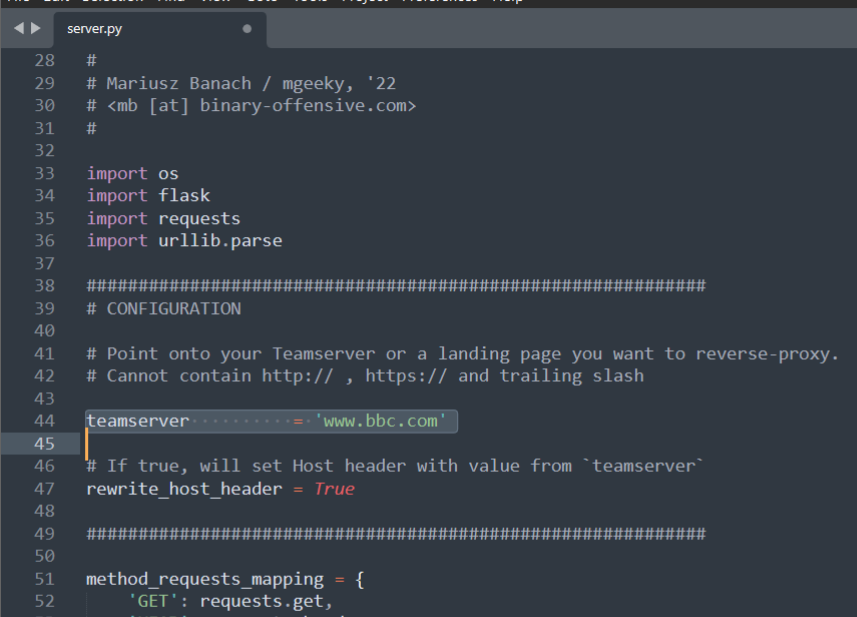
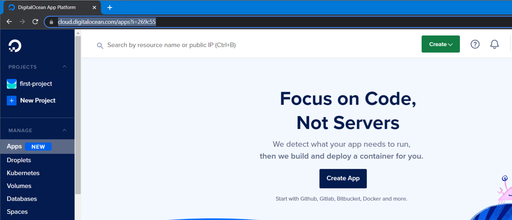
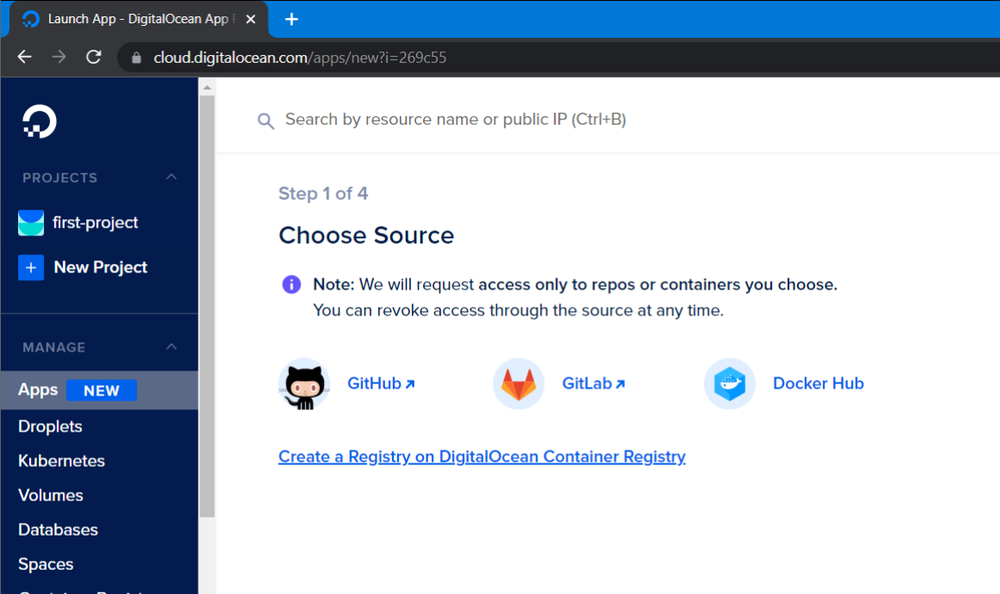
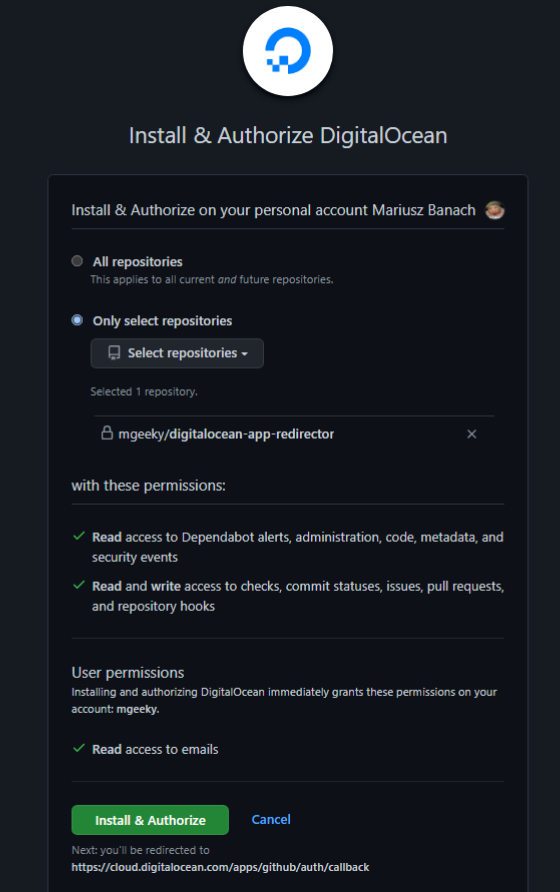
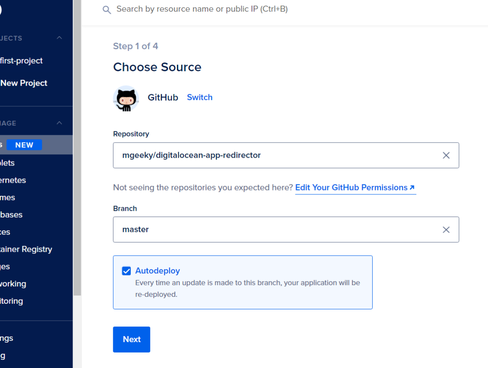
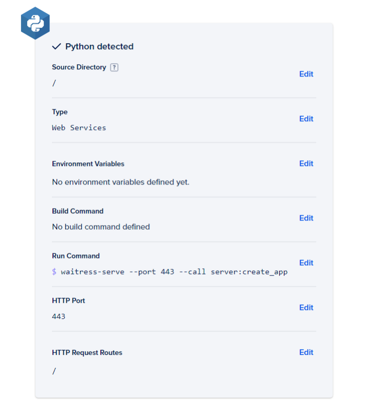
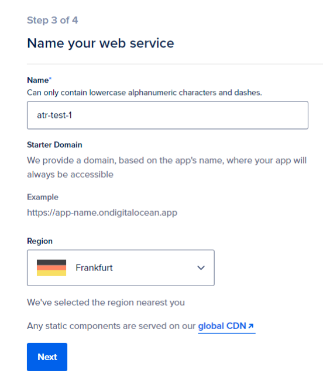
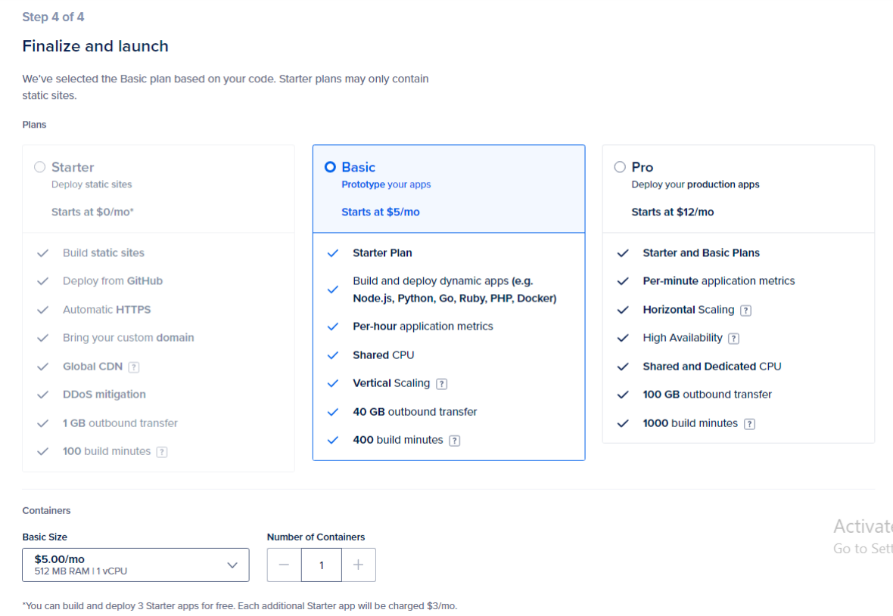
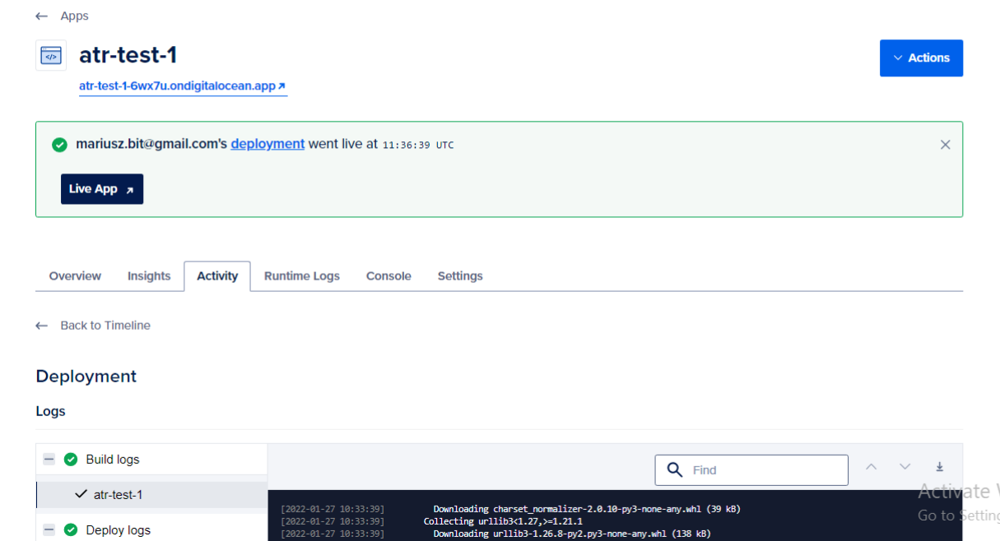
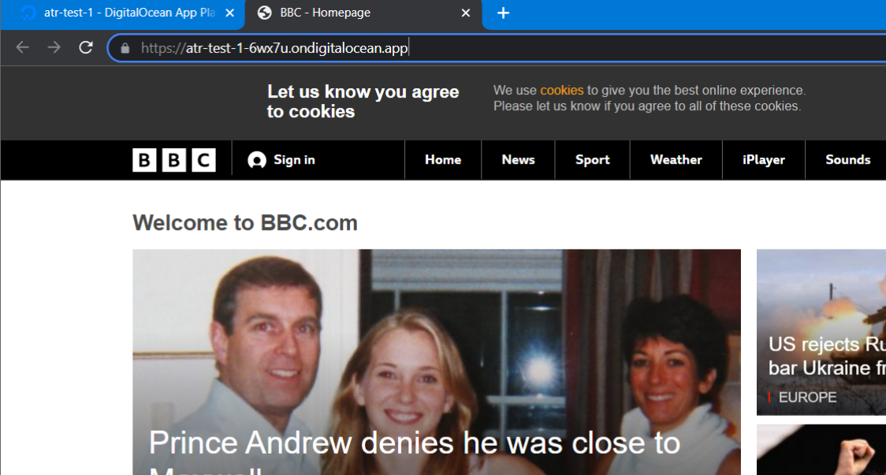

## DigitalOcean Apps Reverse-HTTP Redirector

DigitalOcean cloud platform released Platform-as-a-Service offering named _Apps_ . 
That service is comparable to _AWS Elastic Beanstalk_ and _Azure App Services_ as it may be used by simply supplying customer's code and leaving backend setup stage to DO.

Nowadays cybercriminals are looking for ways to disguise their attacker infrastructures behind well-known and trusted DNS domains, that would evade stringent domain validation engines such as MS Defender for Office365 Safe Links, anti-spam domain-validation systems and others. 

There are plenty of different publicly known ways to hide attacker infrastructures behind trusted domains, such as:
1. [_Domain Fronting_](https://hensonsecuritytools.wordpress.com/2019/11/02/how-domain-fronting-attacks-work-explained-in-seven-steps/) (via Azure CDN, StackPath CDN, etc)
2. [_AWS Lambda_](https://blog.xpnsec.com/aws-lambda-redirector/), [_Azure Function & App Services_](https://www.trustwave.com/en-us/resources/blogs/spiderlabs-blog/azure-web-app-service-for-offensive-operations/), [_CloudFlare Workers_](https://ajpc500.github.io/c2/Using-CloudFlare-Workers-as-Redirectors/) redirectors
3. [_Subdomain Hijacking_](https://canitakeyoursubdomain.name/)
4. [_Domain Borrowing_](https://i.blackhat.com/asia-21/Thursday-Handouts/as-21-Ding-Domain-Borrowing-Catch-My-C2-Traffic-If-You-Can.pdf)

This Flask application will act as a reverse-proxy allowing us to host landing-sites, phishing pages or even C2 communication through `https://your-application-name.ondigitalocean.app` URL.

### Installation


0. Clone this repository to your own Github/Gitlab account:
	https://github.com/mgeeky/digitalocean-app-redirector.git
	
After cloning it, edit the **server.py** to set up your Teamserver URL where that redirector should _redirect_ inbound requests:




1. Go to: https://cloud.digitalocean.com/apps
	
2. Click "**Create App**"


	
3. Connect Digital Ocean with your Github


	
4. Authorize DigitalOcean OAuth2 registration:



5. Select your repository back in DigitalOcean



6. Change Run command to following & change port to 443:

```sh
	waitress-serve --port 443 --call server:create_app
```



7. Click "**Next**"

8. Select a name for your application:



9. Pick "**Basic App**" plan and change Basic Size to **5$/mo** :



	
10. Click "**Launch Basic App**"

11. Now wait :)



12. Then you should have it:

https://atr-test-1-6wx7u.ondigitalocean.app/




Now the resulting URL is a domain to be used by your Implants to egress their connectivity outside of compromised environment.


### More information:

- https://www.microsoft.com/security/blog/2022/01/26/evolved-phishing-device-registration-trick-adds-to-phishers-toolbox-for-victims-without-mfa/


---

### ☕ Show Support ☕

This and other projects are outcome of sleepless nights and **plenty of hard work**. If you like what I do and appreciate that I always give back to the community,
[Consider buying me a coffee](https://github.com/sponsors/mgeeky) _(or better a beer)_ just to say thank you! 💪 

---

```
Mariusz Banach / mgeeky, (@mariuszbit)
<mb [at] binary-offensive.com>
```